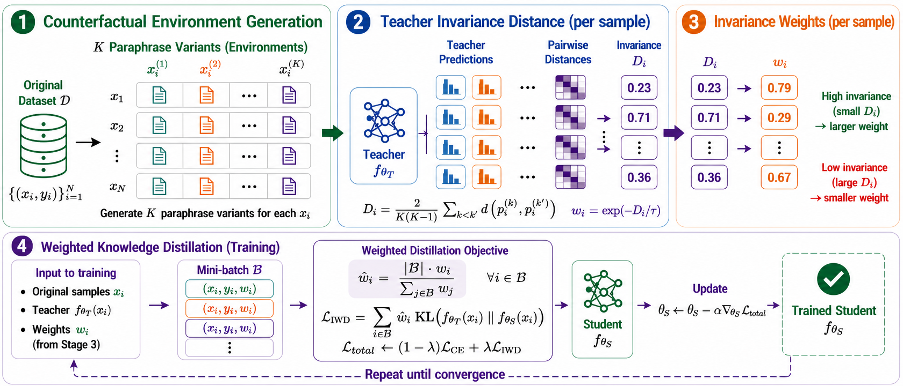

# Do Student LLMs Inherit OOD Robustness?

### Invariance-Weighted Distillation for Reliable Knowledge Transfer


> **Status.** This paper is **under review**. A preprint link will be added here once posted.
> Code and the counterfactual environment generation pipeline are being prepared for release.

---

## TL;DR

Knowledge distillation compresses a large teacher into a small student — but the student inherits
the teacher's **shortcuts**, not just its skill. Distilled students degrade far more than their
teachers under distribution shift.

**IWD (Invariance-Weighted Distillation)** fixes this by asking a simple question of every training
sample: *does the teacher say the same thing when we rewrite the input without changing its
meaning?* If yes, that sample carries causal signal — weight it up. If the teacher's prediction
wobbles, it is riding a surface cue — weight it down.

No architecture changes, no auxiliary heads, no adversarial training. Just a per-sample weight on
the distillation loss, with a proof that it lowers the spurious share of the student's gradient.

**Result: best OOD performance on 15 of 16 benchmarks**, improving average OOD over standard KD by
**+4.34 points on NLI** and **+14.94 points on QA**.

---

## Overview

<p align="center">
  
</p>

<p align="center">
  <em><b>Figure 1.</b> Overview of IWD. (1) <b>Counterfactual Environment Generation</b> — generate
  semantically equivalent paraphrase variants; (2) <b>Teacher Invariance Distance</b> — measure
  prediction consistency across variants using teacher predictions; (3) <b>Weight Calculation</b> —
  assign higher reliability weights to samples whose teacher predictions remain invariant;
  (4) <b>Weighted Knowledge Distillation</b> — train the student with the weighted loss objective.</em>
</p>

---

## The problem

Student models degrade sharply on out-of-distribution data relative to in-distribution data — and
crucially, **the teacher–student gap widens under OOD conditions**. Whatever OOD robustness the
teacher has, standard KD fails to transfer it, and can actively undermine it.

The paper identifies two compounding mechanisms:

| # | Failure mode | What goes wrong |
|---|---|---|
| **1** | **Data spuriousness** | Minimizing discrepancy over a fixed distillation dataset lets the student learn dataset-specific spurious correlations instead of genuine causal relationships. |
| **2** | **Teacher capability** | Standard KD weights every sample equally, ignoring whether the teacher was guided by causal features *on that sample* or misled by a shortcut — forcing the student to imitate the teacher even where the teacher is brittle. |

This motivates the title question: **to what extent do student LLMs inherit OOD robustness from
their teachers, and how can distillation be changed so that they do?**

---

## Method: Invariance-Weighted Distillation

IWD runs in four stages (Figure 1).

### Stage 1 — Counterfactual environment generation

For each training sample, build a set of `K` variants that perturb **spurious** surface features —
register, syntactic structure, domain vocabulary, capitalization, sentence length — while holding
the **causal** semantics that determine the label fixed:

```
E_i = { x_i^(0), x_i^(1), …, x_i^(K−1) }      x_i^(0) ≜ the original sample
```

Formally, each input decomposes into an invariant causal component `c_i` and an
environment-specific spurious component `s_i^(k)`, and the generator enforces **counterfactual
label invariance**:

```
P( y_i | c_i, s_i^(k) )  =  P( y_i | c_i )       ∀ k ∈ {0, …, K−1}
```

Variants are produced offline by prompting GPT-4.1-mini; any paraphrase that would alter the label
is rejected. The union forms an augmented set `D_aug`, precomputed once and shared across all
experiments. This addresses **Limitation 1** on both loss terms: the KL term forces the student to
match the teacher across varied spurious contexts, and the CE term grounds ground-truth prediction
in invariant semantics.

### Stage 2 — Teacher invariance distance

> **Definition 1 (Teacher Invariance Distance).** For teacher predictions `ŷ_i^(k)` on each variant,
>
> ```
> D_i ≜ [ C(K,2) ]⁻¹ · Σ_{0 ≤ u < v ≤ K−1}  d( ŷ_i^(u), ŷ_i^(v) )
> ```
>
> the mean pairwise disagreement across all environment pairs, for a non-negative symmetric `d`.

Because causal features are held fixed across variants, `D_i` **isolates the teacher's sensitivity
to spurious perturbation**. Small `D_i` → predictions are invariant and grounded in causal
semantics → a reliable distillation source. Large `D_i` → predictions fluctuate with surface cues →
the teacher is leaning on something that will not generalize.

`d` is matched to the task's output space: **distributional divergence over softmax outputs** for
classification (MNLI, SST-2), and **per-sample F1 distance (1 − F1) on decoded strings** for
structured symbolic outputs (SQuAD-v2 spans, CoNLL-2003 entities).

### Stage 3 — Weight calculation

A monotonically decreasing exponential maps distance to reliability:

```
w_i = exp( −D_i / τ )
```

Small `τ` penalizes teacher variance aggressively; as `τ → ∞` weighting becomes uniform and IWD
recovers plain environment-augmented distillation. Weights are then **batch-mean normalized**,
`w̃_i = |B| · w_i / Σ_{j∈B} w_j`, which keeps unit average weight per batch and prevents implicit
learning-rate shifts caused by varying `D_i` distributions across mini-batches.

### Stage 4 — Weighted knowledge distillation

```
L_IWD  = Σ_(i,k)∈B  w̃_i · KL( f_θT(x_i^(k)) ‖ f_θS(x_i^(k)) )
L_CE   = Σ_(i,k)∈B  CE( y_i, f_θS(x_i^(k)) )
L_total = (1 − λ) · L_CE  +  λ · L_IWD
```

Down-weighting unstable targets (`w_i → 0`) suppresses the teacher signal on brittle samples,
**forcing the student to fall back on ground-truth supervision** exactly where the teacher is
unreliable.

---

## Theoretical guarantee

> **Definition 2 (Spurious-to-Causal (S2C) Gradient Ratio).** Decompose the teacher's output
> distribution into invariant and spurious parts, `p_T(x_i^(e)) = π_i + s_i^(e)` with
> `E_e[s_i^(e)] = 0` and `E_e‖s_i^(e)‖² = σ_i²`. With `J_i := ∇_θS z_S(x_i)` the student logit
> Jacobian, the causal and spurious gradient components are `g_i^C = (π_i − p_S(x_i))ᵀ J_i` and
> `g_i^S = (s_i^(e_i))ᵀ J_i`, and
>
> ```
> ρ²(W) = E_{i∼W}‖g_i^S‖²  /  E_{i∼W}‖g_i^C‖²
> ```

A lower S2C ratio means a causally dominated gradient — the student prioritizes invariant
predictions over non-transferable surface perturbations.

> **Theorem 1 (IWD Reduces the S2C Gradient Ratio).** Under (A1)–(A3), with
> `W_i^IWD = exp(−σ_i²/τ)/Z` and `W_i^unif = 1/N`:
>
> ```
> ρ²( W^IWD )  ≤  ρ²( W^unif )
> ```
>
> with **equality if and only if `σ_i²` is constant across all samples.**

So IWD cannot do worse than uniform KD in this sense, and strictly improves whenever teacher
invariance actually varies across samples. As `K → ∞`, `D_i` converges to a strictly increasing
function of `σ_i²` (Proposition 1), which is what licenses using the empirical distance in place of
the unobservable spurious variance.

**Assumptions.** **(A1) Zero-mean spurious noise** — `s_i^(e_i)` independent across samples with
zero mean and variance `σ_i²`, representing unstructured prediction variation rather than
systematic dataset bias. **(A2) Independence of spurious variance** — `σ_i² ⊥ (c_i², Φ_i)`,
decoupling teacher prediction invariance from student task difficulty. **(A3) Isotropic logit
Jacobians** — `J_i J_iᵀ = Φ_i I_C` with `Φ_i ⊥ σ_i²`, so updates do not inherently favor spurious
directions.

---

## Experimental setup

Four tasks spanning the major NLP output structures — paired classification, single-sentence
classification, span extraction, token-level labeling — across two model families of markedly
different scale and architecture.

| Task | Training | ID Eval | OOD Sets | Metric |
|---|---|---|---|---|
| **NLI** | MNLI | MNLI-m | HANS, SNLI | Accuracy |
| **Extractive QA** | SQuAD-v2 | SQuAD-v2 | NewsQA, Natural Questions | F1 |
| **NER** | CoNLL-2003 | CoNLL-2003 | WNUT-17, OntoNotes 5.0 | Entity F1 |
| **Sentiment** | SST-2 | SST-2 | Yelp-Polarity, CR | Accuracy |

| Family | Architecture | Student | Teacher |
|---|---|---|---|
| DeBERTa-v3 | Encoder-only | `deberta-v3-xsmall` (~71M) | `deberta-v3-base` |
| Qwen-2.5 | Decoder-only | `Qwen2.5-0.5B` (~494M) | `Qwen2.5-1.5B` |

**Baselines.** `Vanilla KD` (forward KL) · `RevKL` (reverse KL) · `DKD` (decoupled target /
non-target KL) · `LWD` (intermediate-layer alignment) · `AugKD` (vanilla KD on the *same*
counterfactually augmented data — isolating invariance weighting from pure augmentation).

**Training.** AdamW, mixed precision, `T = 2.0`, `τ = 1.0`, `K = 6`.

---

## Main results

| Task / Dataset | Vanilla KD | RevKL | DKD | LWD | AugKD | **IWD (Ours)** |
|---|---|---|---|---|---|---|
| **DeBERTa-v3 Family (Encoder-Only)** | | | | | | |
| *NLI (Accuracy)* | | | | | | |
| &nbsp;&nbsp;MNLI (ID) | 82.02 ± 0.29 | 82.08 ± 0.21 | 79.91 ± 0.47 | 82.56 ± 0.12 | **85.31 ± 0.18** | <u>84.66 ± 0.27</u> |
| &nbsp;&nbsp;HANS (OOD-1) | 52.34 ± 0.57 | 51.45 ± 0.81 | 51.33 ± 0.79 | 52.99 ± 1.10 | <u>60.95 ± 1.30</u> | **61.45 ± 1.01** |
| &nbsp;&nbsp;SNLI (OOD-2) | 78.26 ± 0.58 | 77.49 ± 0.26 | 75.19 ± 0.85 | 78.97 ± 0.92 | <u>80.21 ± 0.24</u> | **80.91 ± 0.50** |
| *Extractive QA (F1)* | | | | | | |
| &nbsp;&nbsp;SQuAD-v2 (ID) | 70.64 ± 0.20 | **72.40 ± 0.81** | 68.01 ± 1.81 | <u>70.97 ± 1.35</u> | 51.50 ± 0.55 | 51.40 ± 0.77 |
| &nbsp;&nbsp;NewsQA (OOD-1) | 39.47 ± 0.77 | 39.95 ± 0.87 | 44.26 ± 0.68 | 36.10 ± 2.48 | <u>54.35 ± 0.66</u> | **55.11 ± 0.45** |
| &nbsp;&nbsp;Natural Questions (OOD-2) | 28.23 ± 0.74 | 28.11 ± 2.67 | 30.52 ± 2.33 | 25.02 ± 5.17 | <u>51.93 ± 0.94</u> | **52.06 ± 0.33** |
| *NER (Entity F1)* | | | | | | |
| &nbsp;&nbsp;CoNLL-2003 (ID) | 92.18 ± 0.11 | 90.59 ± 0.21 | 90.11 ± 0.21 | 90.71 ± 0.20 | <u>92.63 ± 0.22</u> | **92.64 ± 0.10** |
| &nbsp;&nbsp;WNUT-17 (OOD-1) | <u>47.84 ± 0.42</u> | 43.68 ± 0.51 | 46.88 ± 0.35 | 46.34 ± 0.52 | 46.78 ± 0.48 | **48.01 ± 0.31** |
| &nbsp;&nbsp;OntoNotes 5.0 (OOD-2) | 78.99 ± 0.21 | 76.26 ± 0.19 | 77.68 ± 0.32 | 78.12 ± 0.11 | <u>80.27 ± 0.22</u> | **80.38 ± 0.11** |
| *Sentiment Analysis (Accuracy)* | | | | | | |
| &nbsp;&nbsp;SST-2 (ID) | 92.73 ± 0.19 | <u>92.84 ± 0.39</u> | 92.71 ± 0.22 | 92.00 ± 0.30 | **93.21 ± 0.15** | 92.78 ± 0.18 |
| &nbsp;&nbsp;Yelp-Polarity (OOD-1) | <u>91.39 ± 0.19</u> | 91.28 ± 0.24 | 91.36 ± 0.38 | 90.26 ± 0.65 | 90.98 ± 0.56 | **91.42 ± 0.12** |
| &nbsp;&nbsp;CR (OOD-2) | <u>87.29 ± 1.17</u> | 87.08 ± 0.75 | 87.18 ± 0.48 | 85.81 ± 0.25 | 85.32 ± 0.48 | **87.58 ± 0.98** |
| **Qwen-2.5 Family (Decoder-Only)** | | | | | | |
| *NLI (Accuracy)* | | | | | | |
| &nbsp;&nbsp;MNLI (ID) | 81.88 ± 0.50 | 82.13 ± 0.30 | 79.24 ± 0.53 | 80.27 ± 0.36 | <u>82.48 ± 0.20</u> | **83.21 ± 0.19** |
| &nbsp;&nbsp;HANS (OOD-1) | 51.69 ± 0.38 | 52.04 ± 0.85 | 51.61 ± 1.06 | 51.20 ± 0.63 | <u>52.79 ± 1.21</u> | **54.95 ± 1.68** |
| &nbsp;&nbsp;SNLI (OOD-2) | 78.25 ± 0.63 | <u>79.03 ± 0.96</u> | 75.28 ± 1.68 | 76.38 ± 0.86 | 76.99 ± 0.79 | **80.57 ± 0.67** |
| *Extractive QA (F1)* | | | | | | |
| &nbsp;&nbsp;SQuAD-v2 (ID) | **75.48 ± 0.31** | <u>75.02 ± 0.23</u> | 74.68 ± 0.37 | 49.86 ± 0.29 | 47.96 ± 0.43 | 48.84 ± 0.21 |
| &nbsp;&nbsp;NewsQA (OOD-1) | 16.43 ± 0.73 | 16.03 ± 1.30 | 14.88 ± 2.11 | 5.11 ± 1.21 | <u>19.53 ± 0.65</u> | **20.34 ± 0.18** |
| &nbsp;&nbsp;Natural Questions (OOD-2) | 40.89 ± 0.81 | 43.73 ± 2.19 | 35.57 ± 1.02 | 2.37 ± 1.05 | <u>57.12 ± 0.60</u> | **57.25 ± 0.50** |
| *NER (Entity F1)* | | | | | | |
| &nbsp;&nbsp;CoNLL-2003 (ID) | 68.30 ± 0.25 | 67.69 ± 0.30 | 65.00 ± 0.22 | 35.52 ± 0.36 | **69.83 ± 0.20** | <u>69.29 ± 0.10</u> |
| &nbsp;&nbsp;WNUT-17 (OOD-1) | <u>27.48 ± 0.32</u> | 24.88 ± 0.42 | 26.13 ± 0.52 | 12.81 ± 1.30 | 25.02 ± 0.43 | **27.77 ± 0.33** |
| &nbsp;&nbsp;OntoNotes 5.0 (OOD-2) | 54.90 ± 0.40 | <u>54.93 ± 1.00</u> | 53.57 ± 0.68 | 26.58 ± 0.90 | 54.67 ± 0.42 | **55.03 ± 0.67** |
| *Sentiment Analysis (Accuracy)* | | | | | | |
| &nbsp;&nbsp;SST-2 (ID) | **93.46 ± 0.54** | 93.17 ± 0.58 | <u>93.43 ± 0.22</u> | 60.17 ± 3.97 | 92.04 ± 0.89 | 90.11 ± 0.66 |
| &nbsp;&nbsp;Yelp-Polarity (OOD-1) | 84.69 ± 3.11 | **85.99 ± 1.59** | <u>84.99 ± 2.91</u> | 51.17 ± 1.63 | 77.80 ± 0.31 | 83.64 ± 0.86 |
| &nbsp;&nbsp;CR (OOD-2) | 74.57 ± 10.66 | <u>76.87 ± 7.02</u> | 74.95 ± 9.50 | 62.07 ± 3.33 | 73.00 ± 1.09 | **77.80 ± 2.29** |

<p align="center"><em><b>Table 1.</b> Main performance comparison of distilled student models across four NLP tasks
for both DeBERTa-v3 and Qwen-2.5 families, evaluated on one ID and two OOD benchmarks per task.
Mean ± standard deviation across multiple random seeds. <b>Best</b> per benchmark in bold,
<u>second-best</u> underlined.</em></p>

### What the table shows

**IWD wins on OOD, across both architectures.** Top performance in **15 of 16 OOD settings**, with
the largest gains in Extractive QA and NLI:

| Setting | Vanilla KD | IWD | Δ |
|---|---|---|---|
| DeBERTa-v3 · Natural Questions | 28.23 | **52.06** | **+23.83** |
| DeBERTa-v3 · NewsQA | 39.47 | **55.11** | **+15.64** |
| Qwen2.5 · Natural Questions | 40.89 | **57.25** | **+16.36** |
| DeBERTa-v3 · HANS | 52.34 | **61.45** | **+9.11** |
| Qwen2.5 · HANS | 51.69 | **54.95** | **+3.26** |

**IWD is stable where baselines are not.** Non-augmented baselines swing wildly across tasks and
architectures — LWD is competitive on DeBERTa-v3 NLI (52.99 on HANS) but **collapses to 2.37 on
Qwen2.5 Natural Questions**; DKD gains on DeBERTa-v3 QA yet lags Vanilla KD on NLI and Sentiment;
RevKL degrades on DeBERTa-v3 QA despite strong Qwen2.5 results. That instability comes from rigid
assumptions baked into those objectives — target logit geometry, head dynamics, a particular
teacher softmax shape — that hold only for select backbone–task pairs. Invariance to spurious
shifts is a **model-agnostic property**, so IWD stays in the top tier on every OOD split tested.

**The gains are not just data augmentation.** Against AugKD — same augmented data, no
variance-aware weighting — IWD has a **100% win rate across 16 of 16 OOD settings**, +1.60 points
on average. The margin is widest on decoder-only Qwen2.5: Yelp-Polarity **+5.84**, CR **+4.80**,
SNLI **+3.58**.

**Encoder beats decoder, and the reason is instructive.** Under IWD, DeBERTa's lead over Qwen on
HANS expands from +0.65 (Vanilla KD) to +6.50; on NewsQA it reaches +34.77. Encoder-only models
output probabilities over a few task labels, making teacher disagreement clean to measure.
Decoder-only models generate token-by-token over a vast vocabulary, where alternative word choices
add noise to the distance metric even when meaning is identical. **Fully unlocking generative
students likely requires measuring invariance at the semantic rather than token level.**

**The honest trade-off.** ID performance stays competitive on MNLI (84.66), CoNLL-2003 (92.64) and
SST-2 (92.78) — but on SQuAD-v2, both AugKD and IWD show a sharp ID drop versus Vanilla KD
(51.40 vs 70.64 on DeBERTa-v3; 48.84 vs 75.48 on Qwen2.5). This ID–OOD trade-off likely stems from
environment generation shifting the training distribution away from the ID baseline, and is flagged
as a direction for future work.

---

## Additional findings

**Gains track how shortcut-prone a task is.** On DeBERTa-v3 QA, Vanilla KD drops over 42 points from
SQuAD-v2 (70.64) to Natural Questions (28.23); IWD recovers most of that. Sentiment is already
stable under Vanilla KD — just 1.34 points from SST-2 to Yelp-Polarity — so IWD gains are modest
(+0.03 to +0.29). QA and NLI heavily exploit lexical and positional shortcuts that counterfactuals
expose; Sentiment and NER are inherently more context-invariant.

**Scaling.** From 5k to 50k training samples, DeBERTa-v3 gains +16.21 points on HANS
(51.98 → 68.19) versus +13.03 for Qwen2.5 (53.19 → 66.22); both gain roughly +3.00 on SNLI.

**Environment count `K`.** Increasing `K` beyond 3 improves both ID and OOD accuracy. On MNLI,
`K = 3 → 5` yields +2.14 on HANS (56.27 → 58.41); SNLI peaks at 80.60 with `K = 6`. **`K = 5` gives
the best balance of environmental diversity and cost.**

**Ablation summary** (full setups in the appendix):

- **Weight temperature `τ`.** Classification and NER are robust across `τ ∈ [0.3, 3.0]`. Extractive
  QA needs sharp down-weighting (`τ = 0.1`) to suppress high-variance span predictions — worth up
  to **+9.8 F1** OOD.
- **Distance metric.** Aligning metric geometry to the output space is a **key structural design
  decision**. Bounded Jensen–Shannon stabilizes classification by bounding extreme softmax tails;
  structural metrics (Levenshtein, Entity Set F1) eliminate per-token noise and take top OOD on
  NQ (38.19 F1) and WNUT-17 (46.04 F1).
- **Variant utilization.** Distilling across *all* variants beats restricting to the original clean
  text or a single random variant by up to **4.2 points on HANS**.
- **Weight normalization.** Performance is virtually identical (< 0.2-point shift), but batch-mean
  normalization is retained because it stabilizes training by decoupling the learning rate from
  teacher divergence scale.
- **Weight distribution.** Effective sample size stays **≥ 95.0%** across all datasets — IWD does
  smooth, task-adaptive reweighting, not aggressive data pruning.

---

## Key takeaways

1. **Students do not automatically inherit their teacher's OOD robustness** — the teacher–student
   gap widens under shift, and standard KD actively undermines transfer.
2. **Teacher prediction instability across meaning-preserving rewrites is a usable per-sample
   signal** for how much of a sample's gradient is spurious.
3. **It is correctable cheaply** — a loss reweighting, with no architectural modification,
   auxiliary classification head, or adversarial training.
4. **With a guarantee, not a heuristic** — Theorem 1 bounds the S2C gradient ratio and degrades
   gracefully to standard KD when there is no invariance variation to exploit.
5. **Match the distance metric to the output space** — probability divergences for classification,
   structural metrics for span extraction and tagging.

## Limitations

- **Computational overhead** of synthetic environment generation, which can affect distillation
  throughput.
- **Reliance on output-level distance measures** — fine-grained token-level invariance is left as
  future work, and is likely what holds decoder-only students back.
- **ID–OOD trade-off on extractive QA**, where environment generation shifts the training
  distribution away from the ID baseline.

---


## Citation

Under review — please cite the preprint once available.

```bibtex
@misc{iwd2026,
  title  = {Do Student LLMs Inherit OOD Robustness?
            Invariance-Weighted Distillation for Reliable Knowledge Transfer},
  author = {TODO},
  year   = {2026},
  note   = {Under review. Preprint forthcoming.}
}
```

## License

Released under the MIT License. See [`LICENSE`](LICENSE).
